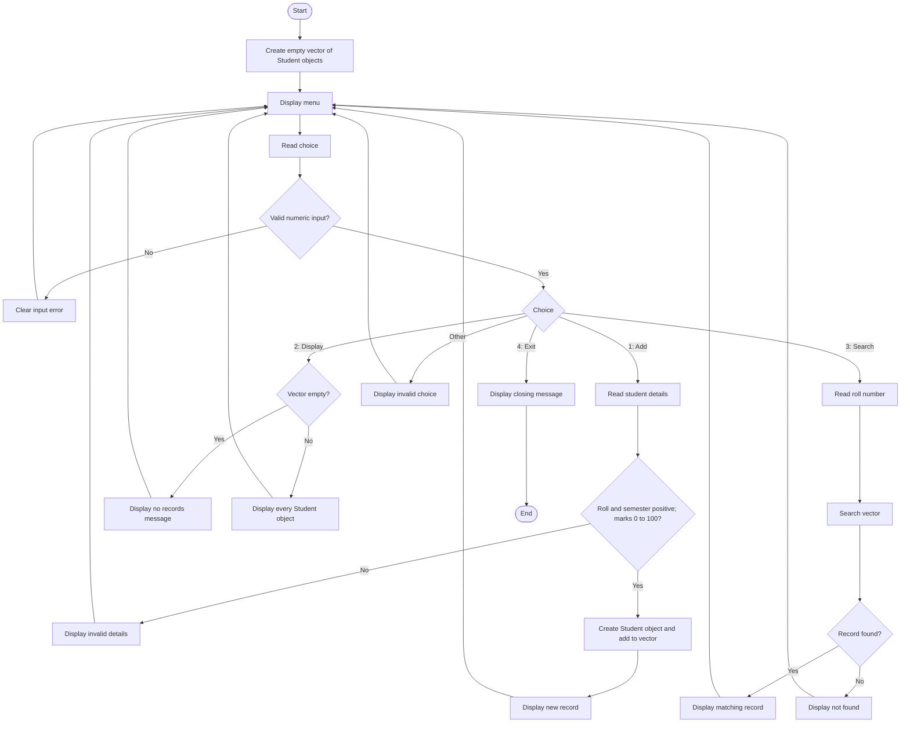

# Program Flowchart

The following Mermaid flowchart can be rendered by GitHub in Markdown viewers that support Mermaid.

```mermaid
flowchart TD
    A([Start]) --> B[Create empty vector of Student objects]
    B --> C[Display menu]
    C --> D[Read choice]
    D --> E{Valid numeric input?}
    E -- No --> F[Clear input error]
    F --> C
    E -- Yes --> G{Choice}
    G -- 1: Add --> H[Read student details]
    H --> I{Roll and semester positive; marks 0 to 100?}
    I -- No --> J[Display invalid details]
    I -- Yes --> K[Create Student object and add to vector]
    K --> L[Display new record]
    J --> C
    L --> C
    G -- 2: Display --> M{Vector empty?}
    M -- Yes --> N[Display no records message]
    M -- No --> O[Display every Student object]
    N --> C
    O --> C
    G -- 3: Search --> P[Read roll number]
    P --> Q[Search vector]
    Q --> R{Record found?}
    R -- Yes --> S[Display matching record]
    R -- No --> T[Display not found]
    S --> C
    T --> C
    G -- 4: Exit --> U[Display closing message]
    G -- Other --> V[Display invalid choice]
    V --> C
    U --> W([End])
```
